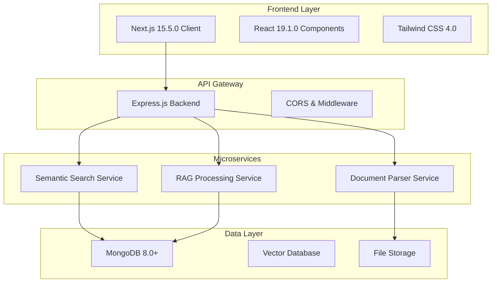
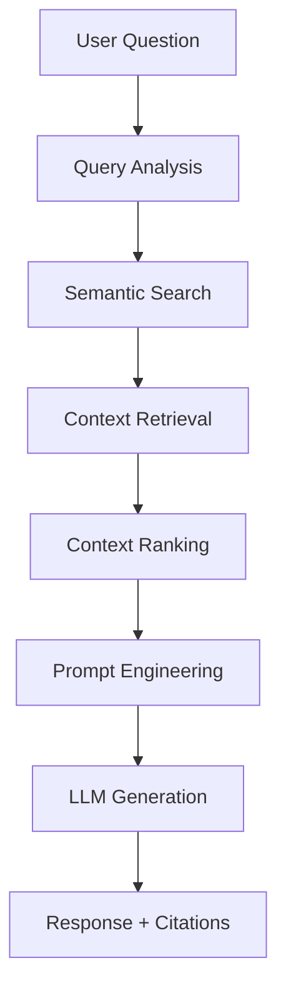

# 🎓 AI-For-Education Platform

> **An intelligent document processing and learning platform powered by advanced AI technologies**

[](https://nextjs.org/)
[](https://nodejs.org/)
[](https://mongodb.com/)
[](https://typescriptlang.org/)
[](https://python.org/)

## 🚀 Project Overview

The AI-For-Education Platform is a sophisticated microservices-based application that transforms how students and educators interact with educational content. By leveraging cutting-edge AI technologies including **Retrieval-Augmented Generation (RAG)**, **semantic search**, and **intelligent document processing**, this platform provides personalized learning experiences through document analysis, interactive Q&A, and adaptive flashcard systems.

### 🎯 Key Value Propositions

- **📚 Intelligent Document Processing**: Upload and parse PDF/Word documents with advanced chunking algorithms
- **🔍 Semantic Search**: AI-powered search that understands context and meaning, not just keywords
- **💬 Interactive Q&A**: RAG-based question answering system with contextual responses
- **🃏 Smart Flashcards**: Automatically generated study cards with spaced repetition and progress tracking
- **📊 Analytics Dashboard**: Comprehensive learning analytics and progress visualization
- **🎨 Modern UI/UX**: Responsive design built with Next.js 15 and Tailwind CSS

---

## 🏗️ System Architecture



### 🧩 Microservices Breakdown

#### 1. **Frontend Application** (Port 3000)
- **Technology**: Next.js 15.5.0 with App Router, React 19.1.0, TypeScript
- **Features**: Server-side rendering, responsive design, real-time updates
- **UI Framework**: Tailwind CSS 4.0 for modern, accessible design

#### 2. **API Gateway & Main Backend** (Port 5000)
- **Technology**: Express.js with TypeScript, MongoDB integration
- **Responsibilities**: Request routing, authentication, file uploads, data persistence
- **Features**: RESTful API, error handling, CORS management

#### 3. **Semantic Search Service** (Port 5005)
- **Technology**: Python with sentence-transformers, FAISS vector database
- **Algorithm**: Multi-signal ranking (40% exact phrases, 30% individual terms, 20% proximity, 10% structure)
- **Features**: Vector embeddings, similarity scoring, context-aware search

#### 4. **RAG Processing Service** (Port 5002)
- **Technology**: Python with Ollama integration, semantic chunking
- **Features**: Question answering, context retrieval, response generation
- **Model**: Optimized for educational content with citation tracking

#### 5. **Database Layer**
- **Primary**: MongoDB 8.0+ for document metadata, user data, flashcards
- **Vector Store**: FAISS for semantic embeddings and similarity search
- **File Storage**: Local file system with organized document management

---

## 🌟 Core Features

### 📄 **Document Management**
- **Multi-format Support**: PDF, Word, TXT document processing
- **Intelligent Parsing**: Semantic-aware chunking that preserves document structure
- **Metadata Extraction**: Automatic title, author, and content categorization
- **Version Control**: Document versioning and update tracking

### 🔍 **Advanced Search System**
- **Semantic Understanding**: Context-aware search beyond keyword matching
- **Multi-modal Queries**: Support for natural language and structured queries
- **Result Ranking**: Sophisticated scoring algorithm with multiple relevance signals
- **Search Analytics**: Query performance and result effectiveness tracking

### 💡 **Interactive Q&A System**
- **RAG Architecture**: Retrieval-Augmented Generation for accurate responses
- **Context Preservation**: Maintains conversation context across questions
- **Source Attribution**: Citations and references for all generated answers
- **Learning Adaptation**: Improves responses based on user feedback

### 🎴 **Smart Flashcard System**
- **Auto-generation**: AI-powered flashcard creation from document content
- **Spaced Repetition**: Scientifically-backed review scheduling
- **Progress Tracking**: Detailed analytics on learning progress
- **Export Capabilities**: CSV export for external study tools
- **Review Modes**: Multiple study modes including timed sessions

### 📊 **Analytics & Insights**
- **Learning Metrics**: Time spent, questions asked, concepts mastered
- **Performance Tracking**: Progress visualization and goal setting
- **Content Analytics**: Most searched topics and knowledge gaps
- **Usage Statistics**: Platform engagement and feature utilization

---

## 🛠️ Technology Stack

### **Frontend Technologies**
- **Framework**: Next.js 15.5.0 (App Router, Server Components)
- **UI Library**: React 19.1.0 with TypeScript 5.0+
- **Styling**: Tailwind CSS 4.0 with custom design system
- **State Management**: React Context API and Server State
- **Build Tool**: Integrated Next.js build system

### **Backend Technologies**
- **Runtime**: Node.js 18+ with Express.js 5.1.0
- **Language**: TypeScript for type safety and developer experience
- **Database**: MongoDB 8.0+ with Mongoose ODM
- **File Processing**: Multer for uploads, pdf-parse for document processing
- **API Design**: RESTful architecture with comprehensive error handling

### **AI/ML Technologies**
- **Embeddings**: sentence-transformers for document vectorization
- **LLM Integration**: Ollama with llama3.2:1b model for resource-efficient text generation
- **Embedding Model**: nomic-embed-text via Ollama for semantic understanding
- **Vector Search**: FAISS for high-performance similarity search and retrieval
- **NLP Processing**: Custom text processing with semantic-aware chunking
- **Model Selection**: Optimized for limited hardware (integrated graphics, older CPUs)
- **RAG Architecture**: Retrieval-Augmented Generation with context-aware responses

### **Infrastructure & DevOps**
- **Containerization**: Docker support for consistent deployment
- **Process Management**: Custom batch scripts for service orchestration
- **Development**: Hot reload, TypeScript compilation, ESLint
- **Monitoring**: Comprehensive logging and error tracking

---

## 📋 Prerequisites

Before setting up the project, ensure you have the following installed:

- **Node.js** v18.0+ ([Download here](https://nodejs.org/))
- **Python** 3.8+ ([Download here](https://python.org/))
- **MongoDB** 8.0+ ([Download here](https://mongodb.com/try/download/community))
- **Ollama** ([Download here](https://ollama.ai/download))
- **Git** ([Download here](https://git-scm.com/))
- **npm** or **yarn** (comes with Node.js)

### **System Requirements**
- **RAM**: Minimum 8GB (16GB recommended for optimal performance)
- **Storage**: 5GB free space for dependencies and models
- **OS**: Windows 10+, macOS 10.15+, or Linux Ubuntu 20.04+

---

## 🚀 Quick Start Guide

### **Automated Setup (Recommended)**

Use our automated setup scripts to install all dependencies and models:

**Linux/macOS:**
```bash
# Make script executable and run
chmod +x setup.sh
./setup.sh
```

**Windows:**
```batch
# Run setup script as administrator
setup.bat
```

The setup script will:
- Install Node.js, Python, MongoDB, and Ollama
- Download required AI models (llama3.2:1b, nomic-embed-text)
- Install all project dependencies
- Create optimized startup scripts
- Verify installation

### **Manual Setup (Alternative)**

### **1. Clone the Repository**
```bash
# Clone the project from GitHub
git clone https://github.com/your-username/AI-For-Education.git

# Navigate to project directory
cd AI-For-Education
```

### **2. Environment Setup**

#### **Install Node.js Dependencies**
```bash
# Install backend dependencies
cd backend
npm install

# Install frontend dependencies
cd ../frontend
npm install

# Return to root directory
cd ..
```

#### **Install Python Dependencies**
```bash
# Install Python packages for AI services
pip install sentence-transformers numpy flask torch transformers

# For GPU acceleration (optional)
pip install torch torchvision torchaudio --index-url https://download.pytorch.org/whl/cu118
```

#### **Setup Ollama and AI Models**

**1. Install Ollama:**
- Download from [ollama.ai](https://ollama.ai/download)
- Follow installation instructions for your OS
- Verify installation: `ollama --version`

**2. Pull Required Models:**
```bash
# Pull the lightweight language model for Q&A generation
ollama pull llama3.2:1b

# Pull the embedding model for semantic search
ollama pull nomic-embed-text

# Verify models are installed
ollama list
```

**3. Start Ollama Service:**
```bash
# Start Ollama server (runs on port 11434 by default)
ollama serve

# Verify service is running
curl http://localhost:11434/api/tags
```

**Why These Models?**
- **llama3.2:1b**: Lightweight (1.3GB) yet capable language model optimized for resource-constrained environments
- **nomic-embed-text**: Efficient embedding model (274MB) designed for semantic search and retrieval tasks
- **Hardware Compatibility**: Both models run efficiently on systems with integrated graphics and older CPUs
- **Performance**: Balanced trade-off between quality and computational requirements

#### **Setup MongoDB**

**Windows:**
```bash
# Create data directory
mkdir C:\data\db

# Start MongoDB (if in PATH)
mongod --dbpath "C:\data\db"

# Or use the provided batch script
start-mongodb.bat
```

**macOS/Linux:**
```bash
# Create data directory
sudo mkdir -p /data/db
sudo chown $(whoami) /data/db

# Start MongoDB
mongod --dbpath /data/db
```

### **3. Launch**

Use the provided startup script for automated service orchestration:

```bash
# Windows
start-all.bat

# This script will start all services in sequence:
# 1. MongoDB (if not running)
# 2. Semantic Search Server (Port 5005)
# 3. RAG Server (Port 5002)
# 4. Backend API (Port 5000)
# 5. Frontend Application (Port 3000)
```

### **4. Manual Startup (Alternative)**

For development or debugging, start services individually:

```bash
# Terminal 1: Backend
cd backend
npm run dev

# Terminal 2: Frontend
cd frontend
npm run dev

# Terminal 3: Semantic Search
cd backend/src/utils
python semantic_search.py

# Terminal 4: RAG Service
cd backend/src/utils
python rag_module.py
```

### **5. Verify Installation**

Check that all services are running:
- **Frontend**: http://localhost:3000
- **Backend API**: http://localhost:5000/api/documents
- **Search Service**: http://localhost:5005
- **RAG Service**: http://localhost:5002/health

---

## 📖 Usage Guide

### **Getting Started**

1. **Access the Platform**: Navigate to http://localhost:3000
2. **Upload Documents**: Click "Upload Document" and select PDF/Word files
3. **Explore Features**: Use the tabbed interface to access different functionalities

### **Document Processing**

```bash
# Supported formats: PDF, DOC, DOCX, TXT
# Maximum file size: 50MB
# Processing time: 30-60 seconds depending on document size
```

1. Select document from file explorer
2. Wait for processing completion
3. Access processed document from the dashboard

### **Search Functionality**

**Basic Search:**
```
Query: "machine learning algorithms"
Results: Contextually relevant sections with similarity scores
```

**Advanced Queries:**
```
Query: "What are the key differences between supervised and unsupervised learning?"
Results: Comprehensive sections with highlighted key differences
```

### **Q&A System**

**Example Interactions:**
```
User: "Explain the concept of neural networks"
AI: "Based on the document, neural networks are..."
[Includes source citations and page references]

User: "How do backpropagation algorithms work?"
AI: "The document describes backpropagation as..."
[Provides step-by-step explanation with diagrams if available]
```

### **Flashcard Study**

1. **Auto-generation**: System creates flashcards from key concepts
2. **Study Mode**: Interactive flip cards with progress tracking
3. **Review Scheduling**: Spaced repetition based on performance
4. **Export Options**: Download as CSV for external tools

---

## 🧠 How It Works: AI Systems Deep Dive

### **🔍 Semantic Search System**

The semantic search system uses a sophisticated multi-stage approach:

#### **1. Document Processing Pipeline**


**Semantic Chunking Algorithm:**
- **Structure-Aware**: Respects document hierarchy (headers, paragraphs, lists)
- **Overlap Strategy**: 50-word overlap between chunks for context preservation
- **Dynamic Sizing**: Adapts chunk size based on content structure (300 words target)
- **Metadata Extraction**: Captures section headers and document structure

**Embedding Generation:**
- **Model**: sentence-transformers (all-MiniLM-L6-v2) via Python
- **Fallback**: nomic-embed-text via Ollama for consistency
- **Vector Size**: 384 dimensions for efficient storage and retrieval
- **Storage**: FAISS vector database for high-performance similarity search

#### **2. Multi-Signal Ranking Algorithm**

Our search combines multiple relevance signals for superior results:

```python
final_score = (
    exact_phrase_match * 0.40 +     # Prioritizes exact phrase matches
    individual_terms * 0.30 +       # Considers individual word matches
    term_proximity * 0.20 +         # Rewards close term proximity
    structural_importance * 0.10     # Weighs document structure
)
```

**Why This Works:**
- **Exact Phrase Priority**: Handles multi-word queries effectively
- **Term Distribution**: Balances comprehensive vs. precise matching
- **Context Awareness**: Proximity scoring maintains semantic relationships
- **Structure Weight**: Headers and important sections get boost

### **🤖 RAG (Retrieval-Augmented Generation) System**

The Q&A system implements a sophisticated RAG architecture:

#### **1. Question Processing Flow**


**Query Enhancement:**
- **Intent Recognition**: Analyzes question type and context
- **Keyword Extraction**: Identifies key terms for better retrieval
- **Query Expansion**: Adds related terms for comprehensive search

#### **2. Context Retrieval & Ranking**

**Retrieval Strategy:**
- **Top-K Selection**: Retrieves top 5-10 most relevant chunks
- **Diversity Filter**: Ensures variety in retrieved content
- **Similarity Threshold**: Filters out low-relevance results (< 0.3 similarity)

**Context Preparation:**
```python
context_prompt = f"""
Use only the following pieces of context to answer the question.
Don't make up any new information:

{formatted_context}

Question: {user_question}
"""
```

#### **3. Language Model Integration**

**Model Selection Rationale:**
- **llama3.2:1b**: Lightweight (1.3GB) yet capable
- **Resource Efficient**: Runs on integrated graphics and older CPUs
- **Context Window**: 4K tokens for comprehensive context
- **Streaming**: Real-time response generation

**Prompt Engineering:**
- **System Instructions**: Clear guidelines for factual responses
- **Context Formatting**: Structured input for better comprehension
- **Citation Integration**: Automatic source attribution
- **Hallucination Prevention**: Strict adherence to provided context

#### **4. Response Generation Process**

**Generation Parameters:**
```python
ollama.chat(
    model='llama3.2:1b',
    messages=[
        {'role': 'system', 'content': instruction_prompt},
        {'role': 'user', 'content': question}
    ],
    stream=True,  # Real-time response
    options={
        'temperature': 0.3,  # Lower creativity for factual responses
        'top_p': 0.9,       # Nucleus sampling for quality
        'max_tokens': 1000   # Comprehensive but focused answers
    }
)
```

**Quality Assurance:**
- **Source Attribution**: Each answer includes relevant document chunks
- **Confidence Scoring**: Similarity scores indicate answer reliability
- **Fallback Handling**: Graceful degradation when models unavailable
- **Error Recovery**: Comprehensive error handling and user feedback

### **📊 Performance Optimizations**

#### **Hardware Efficiency**
- **Model Size**: Sub-2GB total footprint for all models
- **CPU Optimization**: Efficient inference on integrated graphics
- **Memory Management**: Lazy loading and model caching
- **Batch Processing**: Optimized embedding generation

#### **Response Speed**
- **Vector Search**: Sub-100ms similarity search with FAISS
- **Streaming Responses**: Real-time answer generation
- **Caching**: Intelligent caching of embeddings and responses
- **Connection Pooling**: Efficient database and API connections

#### **Scalability Features**
- **Microservices Architecture**: Independent scaling of components
- **Database Sharding**: MongoDB collections optimized for growth
- **Load Balancing**: Multiple service instances supported
- **Resource Monitoring**: Comprehensive logging and metrics

---

## 🔧 API Documentation

### **Core Endpoints**

#### **Document Management**
```http
GET /api/documents
# Returns: List of all uploaded documents

POST /api/documents/upload
# Body: FormData with file
# Returns: Document metadata and processing status

GET /api/documents/:id
# Returns: Specific document details and content

DELETE /api/documents/:id
# Returns: Deletion confirmation
```

#### **Search System**
```http
POST /api/search
# Body: { "query": "search term", "documentId": "doc_id" }
# Returns: Ranked search results with similarity scores

GET /api/search/history
# Returns: User's search history and analytics
```

#### **Q&A System**
```http
POST /api/qa
# Body: { "question": "user question", "documentId": "doc_id" }
# Returns: AI-generated answer with source citations

GET /api/qa/conversations/:documentId
# Returns: Conversation history for specific document
```

#### **Flashcard System**
```http
GET /api/flashcards/:documentId
# Returns: All flashcards for a document

POST /api/flashcards
# Body: { "question": "Q", "answer": "A", "documentId": "doc_id" }
# Returns: Created flashcard

PUT /api/flashcards/:id
# Body: Updated flashcard data
# Returns: Modified flashcard

DELETE /api/flashcards/:id
# Returns: Deletion confirmation

GET /api/flashcards/:documentId/export
# Returns: CSV file download
```

### **Microservice APIs**

#### **Semantic Search Service (Port 5005)**
```http
POST /search
# Body: { "query": "search term", "documents": [...] }
# Returns: Vector similarity results

GET /health
# Returns: Service status and model information
```

#### **RAG Service (Port 5002)**
```http
POST /answer
# Body: { "question": "user question", "context": [...] }
# Returns: Generated answer with confidence scores

GET /health
# Returns: Service status and model readiness
```

---

### **Performance Optimization**

```bash
# Production build
npm run build
npm run start

# Enable compression
export COMPRESS=true

# Optimize AI model loading
export MODEL_CACHE_DIR=/tmp/model_cache
```

---

## 🧪 Testing

### **Automated Testing**

```bash
# Run all tests
npm test

# Run specific test suites
npm test:backend
npm test:frontend
npm test:integration

# Coverage report
npm run test:coverage
```

### **Manual Testing Checklist**

- [ ] Document upload (PDF, Word, TXT)
- [ ] Search functionality with various queries
- [ ] Q&A system with follow-up questions
- [ ] Flashcard creation and study mode
- [ ] Export functionality
- [ ] Responsive design on mobile/tablet
- [ ] Error handling and edge cases
--
